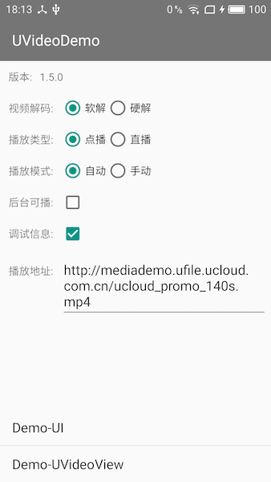

# UCloud多媒体播放器SDK文档

UCDMediaPlayer SDK 是由 UCloud 提供的支持直播、点播播放器。




- 1 [阅读对象](#1)
- 2 [功能特性](#2)
- 3 [开发准备](#3)
    - 3.1 [开发环境配置](#3.1)
    - 3.2 [设备 & 系统](#3.2)
    - 3.3 [混淆说明](#3.3)
- 4 [快速开始](#4)
    - 4.1 [运行 Demo 源码](#4.1)
    - 4.2 [项目集成 SDK](#4.2)
        - step 1: [导入 SDK 库，并添加依赖](#4.2.1)
        - step 2: [添加权限](#4.2.2)
        - step 3: [添加界面元素](#4.2.3)
        - step 4: [启动播放](#4.2.4)
- 5 [功能使用](#5)
    - [状态获取](#5.1)
    - [参数设置](#5.2)
- 6 [反馈和建议](#6)
- 7 [版本历史](#7)


<a name="1"></a>
# 1 阅读对象

本文档面向开发人员、测试人员、合作伙伴及对此感兴趣的其他用户，使用该SDK需具备基本的 Android 开发能力。

<a name="2"></a>
# 2 功能特性

- 支持 RTMP、HLS、HTTP-FLV、RTSP 等协议
- 支持直播、点播播放
- 支持软解、硬解切换
- 支持多清晰度切换
- 支持画幅调整
- 支持全屏、非全屏切换
- 支持屏幕亮度调节
- 支持音量调节
- 支持播放进度拖拉操作
- 支持 armv7a、arm64-v8a 主流芯片体系架构
- 支持 Android 2.3 以上

<a name="3"></a>
# 3 开发准备

<a name="3.1"></a>
## 3.1 开发环境配置

- Android Studio开发工具。官方[下载地址](https://developer.android.com/studio/index.html)
- 下载 UCDMediaPlayer SDK。

<a name="3.2"></a>
## 3.2 设备 & 系统

- 设备要求：搭载 Android 系统的设备
- 系统要求：Android 2.3+ (API 9+)

<a name="3.3"></a>
## 3.3 混淆说明

为保证正常使用 SDK ，请在 proguard-rules.pro 文件中添加以下代码：

```
-keep class com.ucloud.** { *; } 
```

<a name="4"></a>
# 4 快速开始

您可以选择以下两种开始方式，直接运行Demo源码，或者集成SDK到已有项目。

<a name="4.1"></a>
## 4.1 运行Demo源码

打开 Android Studio 菜单 File -> New -> Import Project，选择并指向 SDK 的解压目录，然后点击 OK。若出现库找不到编译失败，更新相应的 SDK 即可。

<a name="4.2"></a>
## 4.2 项目集成 SDK

<a name="4.2.1"></a>
### step 1: 导入 SDK 库，并添加依赖

打开 Android Studio 菜单 File -> New -> Import Module，选择并指向 SDK 解压目录下的 uvod-android-sdk 目录，然后点击 finish。

在 settings.gradle 添加以下代码：

```
include ':uvod-android-sdk'
```

在 build.gradle 添加以下代码：

```
dependencies {
    ...
    compile project(':uvod-android-sdk')
    ...
}
```
    
<a name="4.2.2"></a>
### step 2: 添加权限

使用该 SDK 需在 Androidmainfets.xml 中添加以下权限：

```
<!-- common -->
<uses-permission android:name="android.permission.INTERNET" />
<uses-permission android:name="android.permission.WAKE_LOCK" />
<uses-permission android:name="android.permission.ACCESS_NETWORK_STATE" />
<uses-permission android:name="android.permission.ACCESS_WIFI_STATE" />
```

<a name="4.2.3"></a>
### step 3: 添加界面元素

为了能够展示推流预览界面，您需要使用 UVideoView 进行预览：

```
LayoutParams mLayoutParams = new LayoutParams(LayoutParams.MATCH_PARENT, LayoutParams.MATCH_PARENT);
mLayoutParams.gravity = Gravity.CENTER;
UVideoView mVideoView = new UVideoView(context);
mVideoView.setLayoutParams(mLayoutParams);
setContentView(mVideoView);
```

<a name="4.2.4"></a>
### step 4: 启动播放

先设置视频播放源，然后调用 UVideoView.start() 即可启动播放：

```
mVideoView.setVideoPath(mUri);
mVideoView.start();
```

> 【小细节】  
> 如果您想使用全屏、调节亮度、声音等功能，请参照 Demo 中 UVideoMainView 的使用。

<a name="5"></a>
# 5 功能使用

**UVideoView** 是整个SDK的核心类，是播放接口的承载者。

<a name="5.1"></a>
## 状态获取

如果您希望获取 SDK 内部状态，您可以通过注册 UVideoView.Callback 回调来获取：

```
mVideoView.registerCallback(this);
```

|状态码|描述|
|---|:---:|
|EVENT\_PLAY\_START|开始|
|EVENT\_PLAY\_PAUSE|暂停|
|EVENT\_PLAY\_STOP|停止|
|EVENT\_PLAY\_COMPLETION|结束|
|EVENT\_PLAY\_ERROR|出错|
|EVENT\_PLAY\_DESTORY|资源释放|
|EVENT\_PLAY\_RESUME|继续|
|EVENT\_PLAY\_SEEK\_COMPLETED|进度拖拉|
|EVENT\_PLAY\_INFO\_BUFFERING\_START|缓冲开始|
|EVENT\_PLAY\_INFO\_BUFFERING\_END|缓冲结束|
|EVENT\_PLAY\_TOGGLE\_DEFINITION|清晰度切换|

<a name="5.2"></a>
## 参数设置

如果您希望自定义参数，我们支持以下参数设置：

|参数名|描述|默认值|
|:---:|---|:---:|
|setDecoder|解码类型：DECODER\_VOD\_SW(软解)，DECODER\_VOD\_HW(硬解)|DECODER\_VOD\_SW|
|setRatio|画幅：VIDEO\_RATIO\_FIT\_PARENT(以视频源比例适应父控件)，VIDEO\_RATIO\_WRAP\_CONTENT(以视频源比例自适应大小)，VIDEO\_RATIO\_FILL\_PARENT(以视频源比例填充父控件)，VIDEO\_RATIO\_MATCH\_PARENT(以父控件比例铺满父控件)，VIDEO\_RATIO\_16\_9\_FIT\_PARENT(以16:9比例适应父控件)，VIDEO\_RATIO\_4\_3\_FIT\_PARENT(以4:3比例适应父控件)|VIDEO\_RATIO\_FIT\_PARENT|
|setPlayMode|播放模式：NORMAL(普通)，REPEAT(重复)|NORMAL|
|setPlayType|播放类型：NORMAL(点播)，LIVE(直播)|NORMAL|

<a name="6"></a>
# 6 反馈和建议

  - 主 页：<https://www.ucloud.cn/>
  - issue：[查看已有的 issues 和提交 Bug[推荐]](https://github.com/umdk/UCDMediaPlayer_Android/issues)
  - 邮 箱：[sdk_spt@ucloud.cn](mailto:sdk_spt@ucloud.cn)

<a name="7"></a>
# 7 版本历史

* v1.4.1 (2016.11.03)
    - 修改接口void onEvent(int,String) -> void onEvent(int,Object)
    - 增加setPrepareTimeout(long)接口
    - 增加setReadframeTimeout(long)接口

* v1.3.5 (2015.12.01)
    - 增加UVideoView接口
    - 默认ui界面实现
    - 移至demo

* v1.3.0 (2015.09.16)
    - 增加多清晰度切换
    - 横竖屏切换
    - 画幅调整
    
* v1.2.0 (2015.07.15)
    - 优化手势seek
    - 音量调节
    - 屏幕亮度控制
    
* v1.1.0 (2015.06.20)
    - 基本的播放功能
